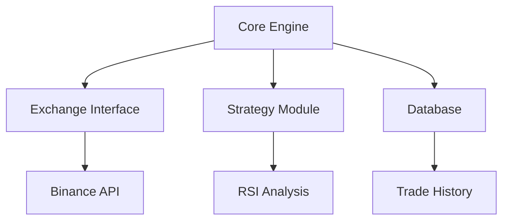

# Crypto Trading Bot

A cryptocurrency trading bot built in Go using the Binance API. This bot implements various trading strategies with a focus on mean reversion trading.

[](https://goreportcard.com/report/github.com/marwanbukhori/player-cryptobot)

Advanced cryptocurrency trading bot implementing mean reversion strategies (for now) with Binance integration.

## Features

- 10-second (configurable) trading interval
- Dual emergency sell triggers
- Tiered profit-taking
- Automated stop-loss
- Mean reversion strategy with RSI indicator
- SQLite database for trade history
- Risk management system
- Real-time PnL monitoring
- Configurable trading parameters
- Telegram notifications (optional)

## Project Structure

Structure of the project:

```bash
player-cryptobot/
├── cmd/ # Command line applications
│ └── bot/ # Main bot application
│ └── main.go # Entry point
├── internal/ # Private application code
│ ├── models/ # Data models
│ ├── config/ # Configuration management
│ ├── database/ # Database operations
│ ├── exchange/ # Exchange integration
│ └── strategy/ # Trading strategies
│ └── risk/ # Risk management
│ └── notifications/ # Notifications
│ └── web/ # Web interface
│ └── backtest/ # Backtesting
├── docs/ # Documentation
├── data/ # Data storing sqlite3 db
└── go.mod # Go module definition
```

## Documentation Hub

| Module                                                | Description         | Key Features                       |
| ----------------------------------------------------- | ------------------- | ---------------------------------- |
| [📈 Strategy](/docs/modules/strategy/STRATEGY.md)     | Core trading logic  | RSI analysis, Tiered exits         |
| [💾 Database](/docs/modules/database/DATABASE.md)     | Trade persistence   | SQLite, Position tracking          |
| [🔗 Exchange](/docs/modules/exchange/EXCHANGE.md)     | Binance integration | Order execution, Balance checks    |
| [🧪 Backtest](/docs/modules/backtest/BACKTEST.md)     | Strategy validation | Historical simulation              |
| [📖 User Manual](/docs/modules/manual/USER_MANUAL.md) | Operational guide   | Setup, Monitoring, Troubleshooting |

## Quick Setup

```bash
# Clone repository
git clone https://github.com/yourusername/player-cryptobot.git
cd player-cryptobot

# Set environment variables
export BINANCE_API_KEY="your_api_key"
export BINANCE_API_SECRET="your_api_secret"
export INITIAL_INVESTMENT="1000"
export TRADING_PAIRS="BTCUSDT,ETHUSDT"
export MIN_ORDER_SIZE="10"
export MAX_DRAWDOWN="0.1"
export RISK_PER_TRADE="0.02"

# Telegram Notifications (optional)
export TELEGRAM_TOKEN="your_bot_token"
export TELEGRAM_CHAT_ID="your_chat_id"

# DB Path
export DB_PATH="trading_bot.db"

# Start bot
go run cmd/bot/main.go
```

## Architecture



[View Full Documentation](/docs/modules/)

```

```
