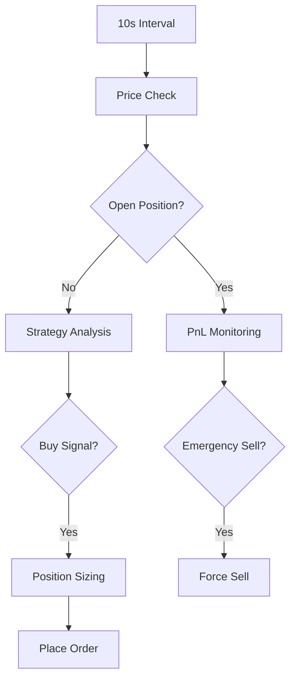

# CryptoTradingBot Documentation

## 1. System Overview

A mean-reversion trading bot that executes automated trades on Binance using a combination of RSI and price range positioning. Key components:

- **Main Loop** (10s interval)
- **Strategy Engine** (RSI + Range Analysis)
- **Order Execution** (Market orders with stop-loss)
- **Risk Management** (Tiered exits, emergency stops)
- **Database** (Trade tracking/position management)

```77:282:cmd/bot/main.go
	for {
		for _, pair := range cfg.TradingPairs {
			price, err := exchange.GetPrice(pair)
			if err != nil {
				log.Error("Error getting price for %s: %v", pair, err)
				notifier.NotifyError(err)
				continue
			}

			var signal *models.Signal
			lastBuy, err := exchange.GetOpenPosition(pair)
			if err == nil && lastBuy != nil {
				potentialProfit := ((price - lastBuy.Price) / lastBuy.Price) * 100
				log.Info("📊 %s Current Price: %.2f | Entry: %.2f | PnL: %.2f%%",
					pair, price, lastBuy.Price, potentialProfit)

				// Emergency sell check
				if potentialProfit < -5.0 {
					log.Error("⚠️🔴 Emergency sell at 5%% loss")
					signal = &models.Signal{
						Symbol: pair,
						Action: "SELL",
					}
				}
			}
				}
			// Analyze market data
			strategySignal := strategy.Analyze(&models.MarketData{
				Symbol: pair,
				Price:  price,
				Time:   time.Now(),
			})
					if usdtBalance < cfg.MinOrderSize {
			if strategySignal != nil {
				signal = strategySignal
				log.Info("🔍 %s Analysis - Price: %.2f USDT, Signal: %s",
					pair, price, signal.Action)
					log.Info("🟢 BUY Signal - %s at %.2f USDT (Balance: %.2f USDT)",
				// Get current position
				balances, err := exchange.GetBalance()
				if err != nil {
					log.Error("Error getting balance: %v", err)
					continue
				}
						log.Error("Error calculating position size: %v", err)
				btcBalance := balances["BTC"]
					}
				// Buy signal handling
				if signal.Action == "BUY" {
					usdtBalance := balances["USDT"]
					if usdtBalance < cfg.MinOrderSize {
						log.Debug("💰 Insufficient USDT balance (%.2f) for trading", usdtBalance)
						continue
					}
					// Ensure minimum order size
					log.Info("🟢 BUY Signal - %s at %.2f USDT (Balance: %.2f USDT)",
						pair, price, usdtBalance)
						log.Debug("💡 Order value (%.2f) below minimum (%.2f), skipping", minOrderValue, cfg.MinOrderSize)
					// Calculate position size based on available USDT and risk management
					stopLoss := price * 0.995 // 0.5% stop loss
					quantity, err := riskManager.CalculatePositionSize(price, stopLoss)
					if err != nil {
						log.Error("Error calculating position size: %v", err)
						continue
					}
						Symbol:    signal.Symbol,
					// Ensure we don't exceed available USDT and respect minimum order size
					maxQuantity := (usdtBalance * 0.95) / price
					if quantity > maxQuantity {
						quantity = maxQuantity
					}
					}
					// Ensure minimum order size
					minOrderValue := quantity * price
					if minOrderValue < cfg.MinOrderSize {
						log.Debug("💡 Order value (%.2f) below minimum (%.2f), skipping", minOrderValue, cfg.MinOrderSize)
						continue
					}
					}
					// Generate position ID for tracking
					positionID := generateUUID()
					trade := &models.Trade{
					order := &models.Order{
						Symbol:    signal.Symbol,
						Side:      "BUY",
						Type:      "MARKET",
						Quantity:  quantity,
						Price:     price,
						Timestamp: time.Now(),
					}
						Status:     "OPEN",
					// Place the buy order
					if err := exchange.PlaceOrder(order); err != nil {
						log.Error("❌ Failed to place BUY order: %v", err)
						notifier.NotifyError(err)
						continue
					}

					// Save trade to database
					trade := &models.Trade{
						Symbol:     order.Symbol,
						Side:       order.Side,
						Price:      price,
						Quantity:   order.Quantity,
						Value:      price * order.Quantity,
						Fee:        price * order.Quantity * 0.001,
						Timestamp:  order.Timestamp,
						PositionID: positionID,
						Status:     "OPEN",
					}
					}
					if err := exchange.SaveTrade(trade); err != nil {
						log.Error("Error saving trade: %v", err)
						continue
					}
					potentialProfit := ((price - lastBuy.Price) / lastBuy.Price) * 100
					// Notify about successful buy
					notifier.NotifyTrade(order.Symbol, order.Side, price, order.Quantity)
					// 1. We get a SELL signal or meet profit target
					log.Info("✅ BUY Order Filled - %s: %.8f at %.2f USDT (Total: %.2f USDT)",
						pair, quantity, price, quantity*price)
				}
							pair, price, lastBuy.Price, potentialProfit)
				// Sell signal handling
				if lastBuy != nil {
					potentialProfit := ((price - lastBuy.Price) / lastBuy.Price) * 100
						// Tiered exit system
					// Added protection
					if potentialProfit < -8.0 {
						log.Error("⚠️🔴 Emergency sell at 8% loss")
						signal.Action = "SELL"
					}
							log.Info("📈 Taking 30% profit at %.2f%%", potentialProfit)
					// Sell when:
					// 1. We get a SELL signal or meet profit target
					// 2. We have crypto balance to sell
					if (signal.Action == "SELL" && btcBalance > 0.0001 && potentialProfit >= 0) || potentialProfit >= 2.0 {
						log.Info("🔴 SELL Signal - %s at %.2f USDT (Entry: %.2f, PnL: %.2f%%)",
							pair, price, lastBuy.Price, potentialProfit)
							Quantity:  sellQuantity,
						sellQuantity := btcBalance
							Timestamp: time.Now(),
						// Tiered exit system
						if potentialProfit >= 5.0 {
							sellQuantity = btcBalance * 0.5 // Sell 50% at 5% profit
							log.Info("📈 Taking 50% profit at %.2f%%", potentialProfit)
						} else if potentialProfit >= 3.0 {
							sellQuantity = btcBalance * 0.3 // Sell 30% at 3% profit
							log.Info("📈 Taking 30% profit at %.2f%%", potentialProfit)
						}
						// Place the sell order
						order := &models.Order{
							Symbol:    signal.Symbol,
							Side:      "SELL",
							Type:      "MARKET",
							Quantity:  sellQuantity,
							Price:     price,
							Timestamp: time.Now(),
						}
							Timestamp:  order.Timestamp,
						// Place the sell order
						if err := exchange.PlaceOrder(order); err != nil {
							log.Error("❌ Failed to place SELL order: %v", err)
							notifier.NotifyError(err)
							continue
						}
						if err := exchange.SaveTrade(sellTrade); err != nil {
						// Before saving the sell trade, update the original BUY trade status
						if err := exchange.UpdateTradeStatus(lastBuy.PositionID, "CLOSED"); err != nil {
							log.Error("Error closing position: %v", err)
						}
						// Notify about successful sell
						// Save trade to database with proper position linking
						sellTrade := &models.Trade{
							Symbol:     order.Symbol,
							Side:       order.Side,
							Price:      price,
							Quantity:   order.Quantity,
							Value:      price * order.Quantity,
							Fee:        price * order.Quantity * 0.001,
							Timestamp:  order.Timestamp,
							PositionID: lastBuy.PositionID,
							Status:     "CLOSED",
							PnL:        (price - lastBuy.Price) * order.Quantity,
							PnLPercent: potentialProfit,
						}
func printTradingSummary(exchange exchange.Exchange, log *logger.Logger) {
						if err := exchange.SaveTrade(sellTrade); err != nil {
							log.Error("Error saving trade: %v", err)
							continue
						}
	}
						// Notify about successful sell
						notifier.NotifyTrade(order.Symbol, order.Side, price, order.Quantity)
	log.Info("Total Trades: %d", len(summary))
						log.Info("✅ SELL Order Filled - %s: %.8f at %.2f USDT (PnL: %.2f%%)",
							pair, order.Quantity, price, potentialProfit)
					}
				}
			}
		}
	log.Info("Total P&L: $%.2f", totalPnL)
		// Adjust trading frequency to prevent rapid trades
		time.Sleep(10 * time.Second) // Changed from 1 minute to 10 seconds
	}
	}
```

## 2. Core Workflow

### 2.1 Main Sequence



### 2.2 Buy Conditions

Triggers when **both**:

1. **RSI < 40** (Oversold)
2. **Price in bottom 20%** of recent range (30-period)

```62:67:internal/strategy/mean_reversion.go
	if positionInRange < 20 && rsi < 40 { // Price near bottom + oversold
		log.Infof("BUY SIGNAL - %s: Price near low (%.2f%%) and RSI oversold (%.2f)",
			data.Symbol, positionInRange, rsi)
		s.entryPrices[data.Symbol] = data.Price
		return &models.Signal{Symbol: data.Symbol, Action: "BUY"}
	}
```

### 2.3 Sell Conditions

Triggers when **all**:

1. **RSI > 60** (Overbought)
2. **Price in top 20%** of recent range
3. **Profit ≥ 2%** (Tiered exits at 3%/5%)

```213:226:cmd/bot/main.go
					if (signal.Action == "SELL" && btcBalance > 0.0001 && potentialProfit >= 0) || potentialProfit >= 2.0 {
						log.Info("🔴 SELL Signal - %s at %.2f USDT (Entry: %.2f, PnL: %.2f%%)",
							pair, price, lastBuy.Price, potentialProfit)
							Quantity:  sellQuantity,
						sellQuantity := btcBalance
							Timestamp: time.Now(),
						// Tiered exit system
						if potentialProfit >= 5.0 {
							sellQuantity = btcBalance * 0.5 // Sell 50% at 5% profit
							log.Info("📈 Taking 50% profit at %.2f%%", potentialProfit)
						} else if potentialProfit >= 3.0 {
							sellQuantity = btcBalance * 0.3 // Sell 30% at 3% profit
							log.Info("📈 Taking 30% profit at %.2f%%", potentialProfit)
						}
```

## 3. Order Execution

### 3.1 Market Orders

- Uses Binance API for instant execution
- Quantity calculated based on:
  - Available balance (95% utilization)
  - 0.5% stop-loss risk

```130:189:internal/exchange/binance.go
func (b *binanceExchange) PlaceOrder(order *models.Order) error {
	// Get current price for accurate calculations
	currentPrice, err := b.GetPrice(order.Symbol)
	if err != nil {
		return fmt.Errorf("failed to get current price: %v", err)
	}
	order.Price = currentPrice // Use actual current price
	order.Price = currentPrice // Use actual current price
	// Check stop loss first before placing new orders
	if order.Side == "SELL" {
		if order.Type == "MARKET" && currentPrice < order.StopLossPrice {
			return fmt.Errorf("market sell blocked: price %.2f < stop loss %.2f", currentPrice, order.StopLossPrice)
		}
	}
	// Check balance before trading
	// Place the actual order
	// Check balance before trading
	balances, err := b.GetBalance()
	if err != nil {
		return fmt.Errorf("failed to get balance: %v", err)
		}
	} else {
	if order.Side == "BUY" {
		// Check USDT balance for buying
		if usdtBalance := balances["USDT"]; usdtBalance < (order.Price * order.Quantity) {
			return fmt.Errorf("insufficient USDT balance: have %.2f, need %.2f",
				usdtBalance, order.Price*order.Quantity)
		}
	} else {
		// Check BTC balance for selling
		if btcBalance := balances["BTC"]; btcBalance < order.Quantity {
			return fmt.Errorf("insufficient BTC balance: have %.8f, need %.8f",
				btcBalance, order.Quantity)
		}
	}
	orderService := b.client.NewCreateOrderService().
	// Round quantity to valid lot size
	quantity := roundToValidQuantity(order.Quantity)
	if quantity <= 0 {
		return fmt.Errorf("order quantity too small: %.8f", order.Quantity)
	}
		Symbol(order.Symbol).
	orderService := b.client.NewCreateOrderService().
		Symbol(order.Symbol).
		Side(binance.SideType(order.Side)).
		Type(binance.OrderTypeMarket).
		Quantity(fmt.Sprintf("%.8f", quantity)).
		NewOrderRespType("FULL")
	// Update order details with actual execution price and quantity
	// Execute spot order
	result, err := orderService.Do(context.Background())
	if err != nil {
		return fmt.Errorf("failed to place spot order: %v", err)
	}
	}
	// Update order details with actual execution price and quantity
	order.Price, _ = strconv.ParseFloat(result.Price, 64)
	order.Quantity, _ = strconv.ParseFloat(result.ExecutedQuantity, 64)
		symbol, interval, limit)
	// Immediately place stop loss order after successful buy
```

### 3.2 Stop-Loss Mechanism

- Auto-placed after successful buy:
  - Stop price: 0.5% below entry
  - Limit price: 0.498% below entry (avoid slippage)

```189:200:internal/exchange/binance.go
	// Immediately place stop loss order after successful buy
	if order.Side == "BUY" {
		stopLossPrice := order.Price * 0.995 // 0.5% stop loss
		if stopLossPrice <= 0 {
			return fmt.Errorf("invalid stop loss price: %.2f", stopLossPrice)
		}
		limitPrice := stopLossPrice * 0.998
		stopLossOrder := &models.Order{
			Symbol:        order.Symbol,
			Side:          "SELL",
			Type:          "STOP_LOSS_LIMIT",
			Quantity:      order.Quantity,
```

## 4. Risk Management

### 4.1 Tiered Exit System

| Profit Level | Action        |
| ------------ | ------------- |
| ≥2%          | Full Position |
| ≥3%          | Sell 30%      |
| ≥5%          | Sell 50%      |

### 4.2 Emergency Protocols

- **-5% PnL**: Warning & auto-sell prep
- **-8% PnL**: Immediate market sell

```94:100:cmd/bot/main.go
				if potentialProfit < -5.0 {
					log.Error("⚠️🔴 Emergency sell at 5%% loss")
					signal = &models.Signal{
						Symbol: pair,
						Action: "SELL",
					}
				}
```

## 5. Database Schema

### 5.1 Trade Model

| Field      | Description                 |
| ---------- | --------------------------- |
| PositionID | UUID linking BUY/SELL pairs |
| Status     | OPEN/CLOSED                 |
| PnL        | Realized profit/loss        |
| PnLPercent | Percentage return           |

```176:186:cmd/bot/main.go
					trade := &models.Trade{
						Symbol:     order.Symbol,
						Side:       order.Side,
						Price:      price,
						Quantity:   order.Quantity,
						Value:      price * order.Quantity,
						Fee:        price * order.Quantity * 0.001,
						Timestamp:  order.Timestamp,
						PositionID: positionID,
						Status:     "OPEN",
					}
```

## 6. Common Scenarios

### 6.1 Normal Trade Cycle

1. BTC drops to $48,000 (RSI 35)
2. Bot buys 0.1 BTC
3. Price rises to $49,500 (RSI 65)
4. Bot sells 50% at 3% profit
5. Remainder sold at 5% profit

### 6.2 Emergency Exit

1. Entry at $50,000
2. Price drops to $47,500 (-5%)
3. Bot triggers emergency sell
4. Position closed at market price

## 7. Troubleshooting Guide

### 7.1 "Invalid Stop Loss" Error

**Cause:** Failed price parsing in order execution
**Fix:** Added price validation check

```186:187:internal/exchange/binance.go
	order.Price, _ = strconv.ParseFloat(result.Price, 64)
	order.Quantity, _ = strconv.ParseFloat(result.ExecutedQuantity, 64)
```

### 7.2 Stuck OPEN Positions

**Cause:** Missing status update on SELL
**Fix:** Implement position closure flow

```245:247:cmd/bot/main.go
						if err := exchange.UpdateTradeStatus(lastBuy.PositionID, "CLOSED"); err != nil {
							log.Error("Error closing position: %v", err)
						}
```

## 8. Appendices

### 8.1 Key Files

- `cmd/bot/main.go`: Core trading logic
- `internal/strategy/mean_reversion.go`: Signal generation
- `internal/exchange/binance.go`: Exchange integration

### 8.2 Glossary

- **RSI**: Relative Strength Index (30-70 range)
- **PnL**: Profit and Loss (Realized/Unrealized)
- **PositionID**: Unique trade pair identifier

[View Full Strategy Manual](docs/STRATEGY_MANUAL.md)
[Backtesting Framework](internal/backtest/backtest.go)
